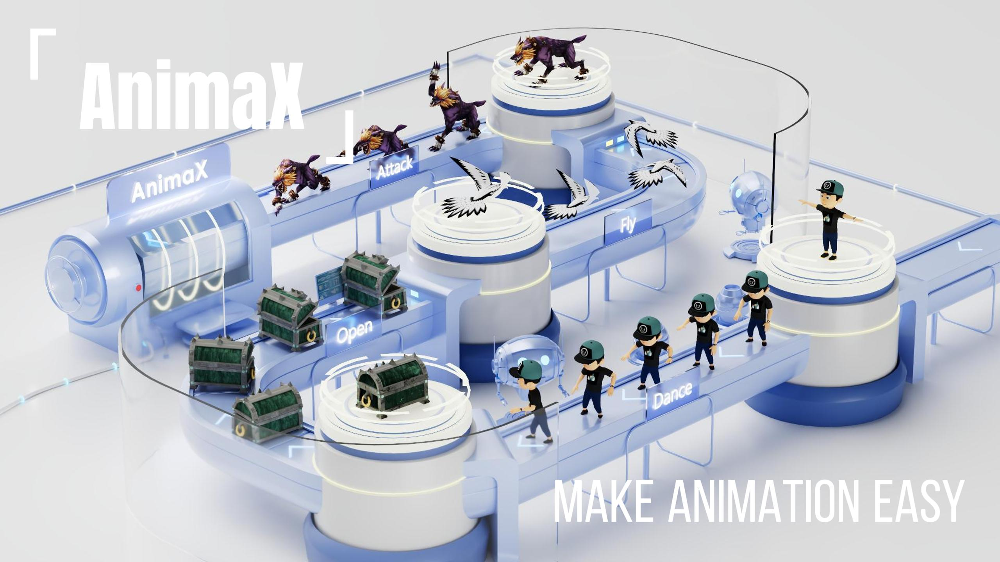

# AnimaX: Animating the Inanimate in 3D with Joint Video-Pose Diffusion Models

## 🏠 [Project Page](https://anima-x.github.io) | [Paper]()

AnimaX is a feed-forward 3D animation framework that bridges the motion priors of video diffusion models with the controllable structure of skeleton-based animation.
Traditional motion synthesis methods are either restricted to fixed skeletal topologies or require costly optimization in high-dimensional deformation spaces.
In contrast, AnimaX effectively transfers video-based motion knowledge to the 3D domain, animating diverse articulated meshes in arbitrary skeletal systems with text conditions.

## 📢 News

## Citation
